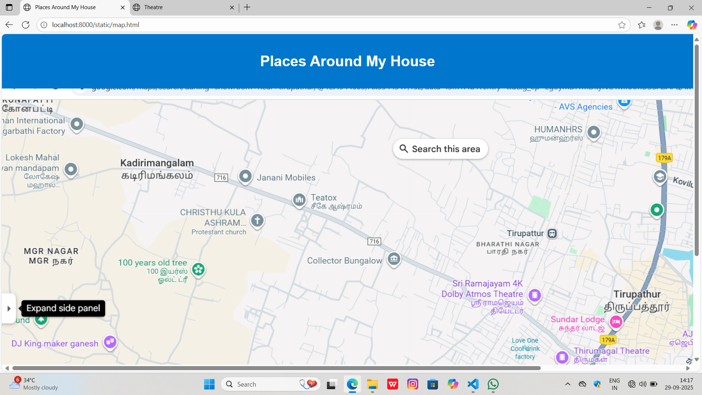
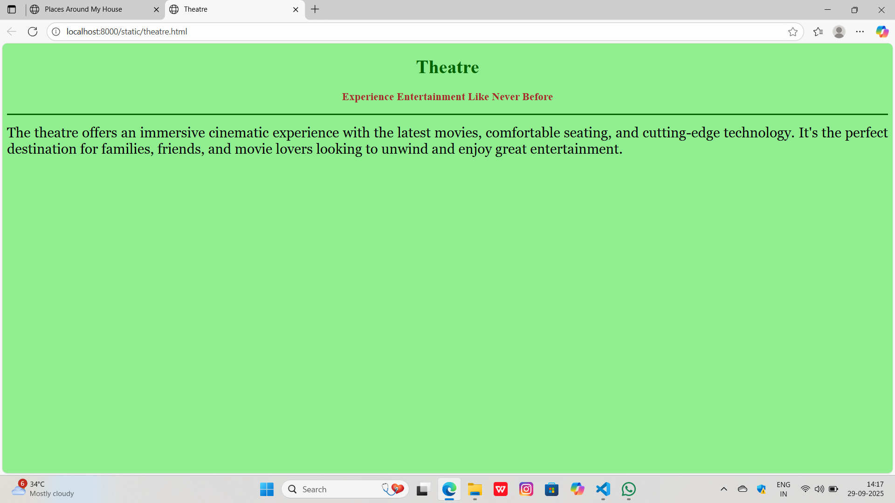
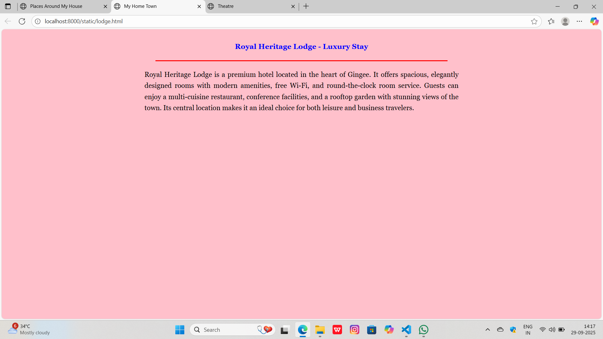
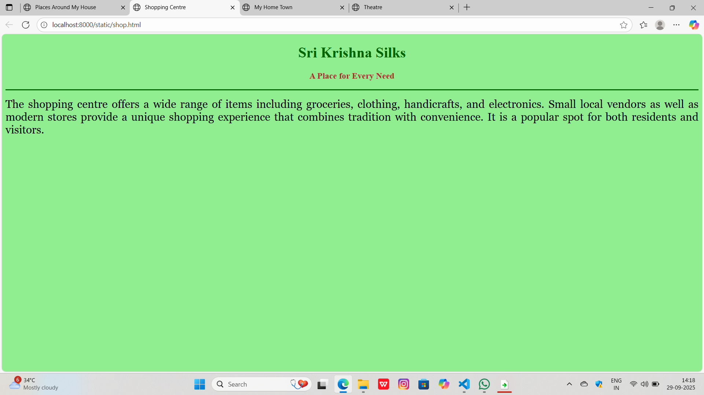
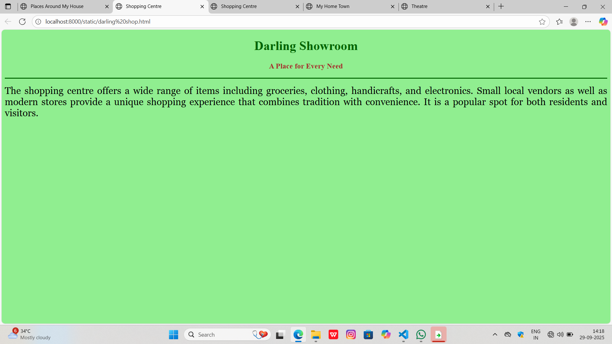
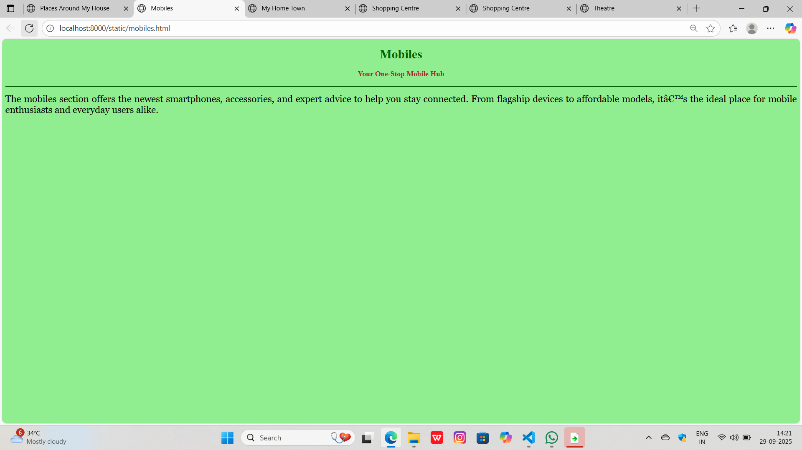

# Ex04 Places Around Me
## Date: 29.09.25

## AIM
To develop a website to display details about the places around my house.

## DESIGN STEPS

### STEP 1
Create a Django admin interface.

### STEP 2
Download your city map from Google.

### STEP 3
Using ```<map>``` tag name the map.

### STEP 4
Create clickable regions in the image using ```<area>``` tag.

### STEP 5
Write HTML programs for all the regions identified.

### STEP 6
Execute the programs and publish them.

## CODE
~~~
map.html

<!DOCTYPE html>
<html lang="en">
<head>
  
  <title>Places Around My House</title>
  <style>
    body {
      font-family: Arial, sans-serif;
      background-color: #f2f2f2;
      margin: 0;
      padding: 0;
    }
    header {
      background-color: #0077cc;
      color: white;
      padding: 20px;
      text-align: center;
    }
    .container {
      padding: 20px;
    }
    .place {
      background-color: white;
      border-radius: 8px;
      padding: 15px;
      margin-bottom: 20px;
      box-shadow: 0 2px 5px rgba(0,0,0,0.1);
    }
    .place h2 {
      margin-top: 0;
      color: #0077cc;
    }
    .place p {
      margin: 5px 0;
    }
    footer {
      text-align: center;
      padding: 10px;
      background-color: #ddd;
      font-size: 0.9em;
    }
  </style>
</head>
<body>

  <header>
    <h1>Places Around My House</h1>
  </header>
<center>
    

<map name="image-map">
    <area target="_blank" alt="Theatre" title="Theatre" href="theatre.html" coords="948,417,1182,498" shape="rect">
    <area target="_blank" alt="Shop" title="Shop" href="shop.html" coords="1089,621,1291,692" shape="rect">
    <area target="_blank" alt="Lodge" title="Lodge" href="lodge.html" coords="1195,487,1364,544" shape="rect">
    <area target="_blank" alt="Darling Shop" title="Darling Shop" href="darling shop.html" coords="1114,741,1319,798" shape="rect">
    <area target="_blank" alt="Mobiles" title="Mobiles" href="mobiles.html" coords="510,166,715,213" shape="rect">
</map>
</center>
  

</body>
</html>
lodge.html
<!DOCTYPE html>
<html lang="en">
<head>
  <title>My Home Town</title>
  <style>
    body {
      background-color: pink;
      font-family: Georgia, serif;
      line-height: 1.6;
      margin: 0;
      padding: 20px;
    }

    h1, h3 {
      text-align: center;
      margin: 0.5em 0;
    }

    h1 {
      color: red;
    }

    h3 {
      color: blue;
      font-weight: bold;
    }

    hr {
      border: none;
      border-top: 3px solid red;
      width: 50%;
      margin: 20px auto;
    }

    p {
      text-align: justify;
      font-size: 1.1rem;
      max-width: 800px;
      margin: 0 auto;
    }
  </style>
</head>
<body>
  <h3>Royal Heritage Lodge - Luxury Stay</h3>
  <hr>
  <p>
    Royal Heritage Lodge is a premium hotel located in the heart of Gingee. It offers 
    spacious, elegantly designed rooms with modern amenities, free Wi-Fi, and 
    round-the-clock room service. Guests can enjoy a multi-cuisine restaurant, 
    conference facilities, and a rooftop garden with stunning views of the town. 
    Its central location makes it an ideal choice for both leisure and business travelers.
  </p>
</body>
</html>
darling shop.html
<!DOCTYPE html>
<html>
<head>
    <title>Shopping Centre</title>
</head>
<body bgcolor="lightgreen">
    <h1 align="center">
        <font color="darkgreen"><b>Darling Showroom</b></font>
    </h1>
    <h3 align="center">
        <font color="brown"><b>A Place for Every Need</b></font>
    </h3>
    <hr size="3" color="darkgreen">
    <p align="justify">
        <font face="Georgia" size="5">
            The shopping centre offers a wide range of items including 
            groceries, clothing, handicrafts, and electronics. 
            Small local vendors as well as modern stores provide a unique 
            shopping experience that combines tradition with convenience. 
            It is a popular spot for both residents and visitors.
        </font>
    </p>
</body>
</html>
mobile.html
<!DOCTYPE html>
<html>
<head>
    <title>Mobiles</title>
</head>
<body bgcolor="lightgreen">
    <h1 align="center">
        <font color="darkgreen"><b>Mobiles</b></font>
    </h1>
    <h3 align="center">
        <font color="brown"><b>Your One-Stop Mobile Hub</b></font>
    </h3>
    <hr size="3" color="darkgreen">
    <p align="justify">
        <font face="Georgia" size="5">
            The mobiles section offers the newest smartphones, accessories, and expert advice to help you stay connected. 
            From flagship devices to affordable models, it’s the ideal place for mobile enthusiasts and everyday users alike.
        </font>
    </p>
</body>
</html>
shop.html
<!DOCTYPE html>
<html>
<head>
    <title>Shopping Centre</title>
</head>
<body bgcolor="lightgreen">
    <h1 align="center">
        <font color="darkgreen"><b>Sri Krishna Silks</b></font>
    </h1>
    <h3 align="center">
        <font color="brown"><b>A Place for Every Need</b></font>
    </h3>
    <hr size="3" color="darkgreen">
    <p align="justify">
        <font face="Georgia" size="5">
            The shopping centre offers a wide range of items including 
            groceries, clothing, handicrafts, and electronics. 
            Small local vendors as well as modern stores provide a unique 
            shopping experience that combines tradition with convenience. 
            It is a popular spot for both residents and visitors.
        </font>
    </p>
</body>
</html>
threatre.html
<!DOCTYPE html>
<html>
<head>
    <title>Theatre</title>
</head>
<body bgcolor="lightgreen">
    <h1 align="center">
        <font color="darkgreen"><b>Theatre</b></font>
    </h1>
    <h3 align="center">
        <font color="brown"><b>Experience Entertainment Like Never Before</b></font>
    </h3>
    <hr size="3" color="darkgreen">
    <p align="justify">
        <font face="Georgia" size="5">
            The theatre offers an immersive cinematic experience with the latest movies, comfortable seating, and cutting-edge technology. 
            It's the perfect destination for families, friends, and movie lovers looking to unwind and enjoy great entertainment.
        </font>
    </p>
</body>
</html>
~~~

## OUTPUT







## RESULT
The program for implementing image maps using HTML is executed successfully.
